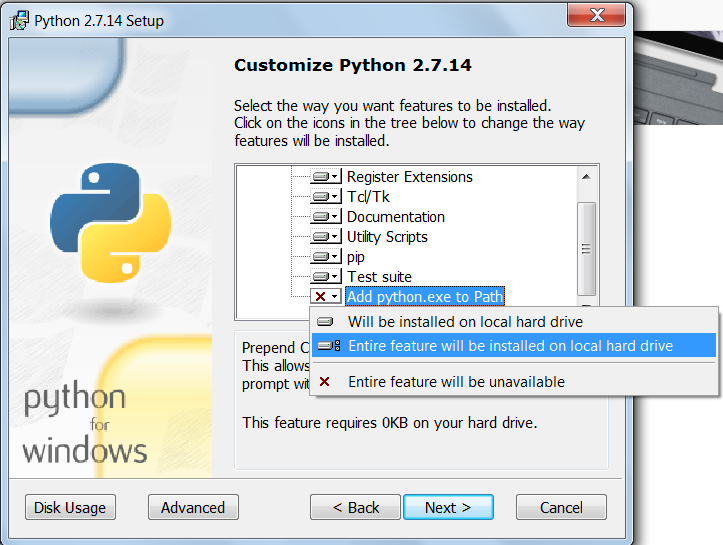

## Installation

Daba is designed to be a cross-platform application, see installation
instructions below for Windows, MacOS and Linux.

Dependencies: 

* Python 2.7
 
  Python 3.* is not yet supported, support for both Python 2 and 3
  is planned.
   
* wxPython >= 4.0.0 
 
  Earlier versions of wxPython may work, but support is not
  guaranteed and daba applications may fail unexpectedly.

### Windows

#### Step 1. Install Python

If you do not have Python 2.7 installed, navigate to the [Python
   downloads page](https://www.python.org/downloads/windows/) and
   choose the latest Python 2.7 distribution. Please note that daba
   won't work with Python 3.*.
   
**Important note:** When running the Python installation wizard make
sure that you do not skip the Customization screen. You need to enable
**Add python.exe to Path** option which is *disabled by default*. 



If you already have Python installed check that this option is
enabled: start command prompt (All programs > Run > cmd) and type 
`python --version` followed by Enter. If you see something like 

```
C:\Users\User>python --version
Python 2.7.14

c:\Users\User>
```

Everything is OK and you can skip to the Step 2. If you see an
error message that python is not a recognized command, you have two
options: 

1. Reinstall Python and enable "Add python.exe to Path"
2. Follow the instructions
   [here](https://stackoverflow.com/questions/6318156/adding-python-path-on-windows-7#6318188)
   to add Python to Path. Make sure that you add `C:\Python27\;C:\Python27\Scripts`.
   
#### Step 2. Install daba

1. Open Windows command prompt. Press Winkey+R and enter `cmd` in the
   input line of the window that opened. You should see the black
   screen of the Command prompt. If that does not work, try any of the
   methods described
   [here](https://www.lifewire.com/how-to-open-command-prompt-2618089). 
   
2. In the Command prompt window type the command followed by Enter:

```
pip install -U https://github.com/maslinych/daba/archive/maint.zip
```

If you see no error messages, you have daba successfully installed and
can skip to Step 3.

On some Windows versions there may be troubles with automatic wxPython
installation. In that case refer to [wxPython installation
documentation](https://www.wxpython.org/pages/downloads/). 
When wxPython is successfully installed, just run daba installation
command again.

#### Step 3. Run daba applications

To run any of the daba applications you will need to open Command
prompt window (as in Step 2 above) and type the name of one of the
daba apps (`gdisamb`, `gparser`, `meta`) followed by Enter. This may
be done from any directory.


### Mac OS

**TBD**

### Linux

#### Step 1. Make sure you have python 2.7 and pip available in your system

Most Linux distributions already have Python and pip installed. You
can check that they are present by lauching a terminal and performing
a command:

```
$ python --version
Python 2.7.14
$ pip --version
pip 9.0.1 from /usr/lib/python2.7/site-packages (python 2.7)
```

Please note that daba won't work with Python 3.*. If you need to
install Python and/or pip, use standard package management system of
your distribution. 

#### Step 2. Install daba

Open a terminal and enter a command:

```
$ pip install -U https://github.com/maslinych/daba/archive/maint.zip
```

If you see no error messages, you have daba successfully installed and
can skip to Step 3.

On some Linux distributions there may be troubles with automatic
wxPython installation. In that case refer to [wxPython installation
documentation](https://www.wxpython.org/pages/downloads/).  When
wxPython is successfully installed, just run daba installation command
again.

#### Step 3. Run daba applications

Any daba applications may be called from a terminal with commands: 

* `gdisamb` — disabmiguation interface;
* `gparser` — morphological parser;
* `meta` — metadata editor.


